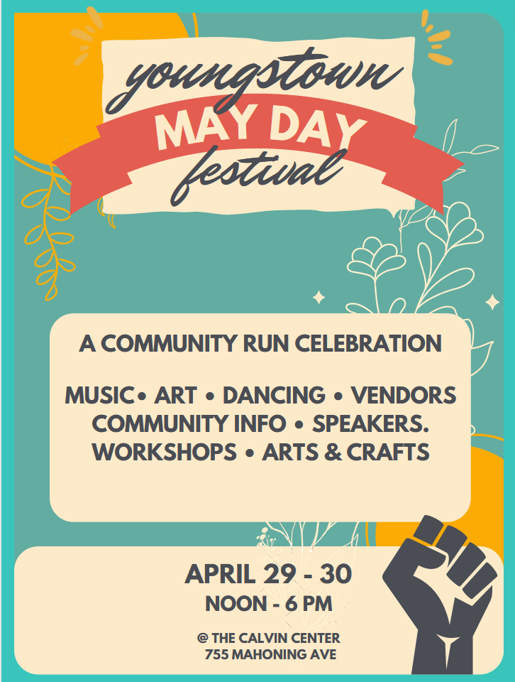

+++
title = "Youngstown Action Center"
template = "index.html"
+++

## Welcome to the Youngstown Action Center
Welcome to the Youngstown Action Center, a welcoming, queer-friendly DIY community run space for meeting, co-working, events, community meals, and more - including a movement library - located minutes from YSU and downtown Youngstown at 107 Park Avenue.

We come together to share our passion for worker justice, environmental and climate justice, racial justice, reproductive freedom, LGBTQAI+ community support and freedom, local sustainability, and robust democratic processes.

Sign up here to get our newsletter and let us know how you'd like to be part of our community.

Follow us on Facebook to get invites to events and updates about what's going on with us!
Support us through our donation portal at Open Collective, a great, super transparent online fiscal sponsor.

## Youngstown Solidarity Presents: May Day 2023

Youngstown Solidarity and the Youngstown Action Network are proud to present The Youngstown May Day Festival!

Now in its third year, The Youngstown May Day Festival welcomes care-oriented, labor supporting, earth-friendly community members to join together traditions old and new in celebration of the return of abundance and find new ways to build health and strength together for nature, workers, and each other. 

This free event brings together music, art, speakers, workshops, tabling, vendors, arts & crafts, dancing, and food in both indoor and outdoor spaces. We promote the event through media coverage, social media, mailing lists, flyering, and radio PSAs to ensure good attendance.

We are a community-run celebration of care and people-power that forms a beloved community with a mix of supporters of labor, celebrants of Beltane, those supporting immigrants, climate justice and eco-conscious people, and other supporters of justice, care, and action for a sustainable planet, fair workplace, and inclusive communities.

We are proud to be an multiracial, LGBTQAI+ affirming coalition of folks both interfaith and secular and welcoming those with all ranges of abilities, regardless of immigration status, and we're thankful for you to be welcoming and tolerant on these and other intersections of vulnerability. **Together, we are stronger**.

## Join us at our May Day event page at [Facebook](https://www.facebook.com/events/646229347165317/)

## Contact Us at [youngstownsolidarity@gmail.com](mailto:youngstownsolidarity@gmail.com)

